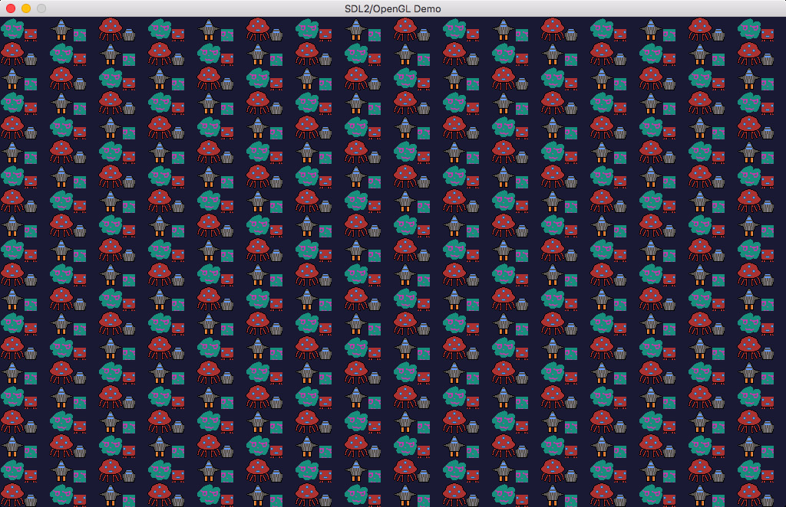
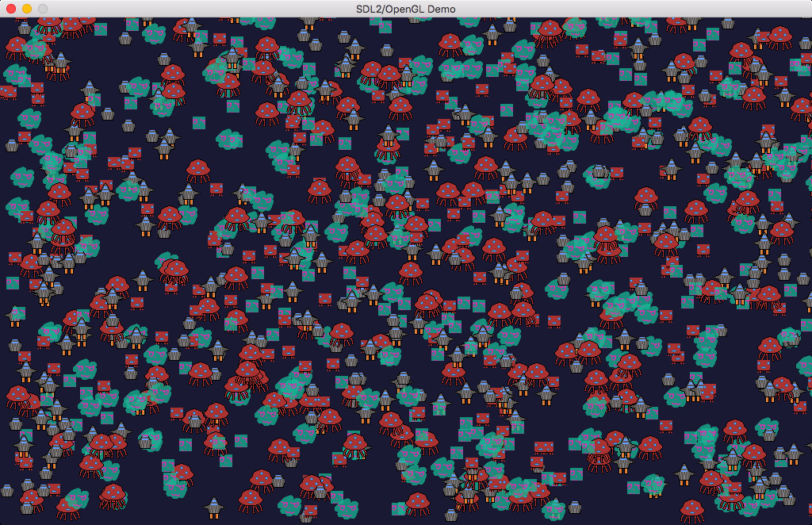

# sprite-instancing

OpenGL の Instancing を使ったスプライト描画の高速化を検証したコード

WebGL 1.0 で動作させる場合、ビルドに emscripten が必要

macOS でデスクトップ OpenGL 2.1 を使って動作させる場合、 SDL2 と glew が必要。
SDL2は `SDL2.framework` と `SDL2_image.framework` がホームディレクトリの `Library/Frameworks` にある想定、
glewはmacportsでインストールしてある想定、となってるので、なんか違う場合 `build-macos.sh` を適当に変える。

# 参考記録

WebGL版

| sprites | SDL@Firefox | SDL@Safari | instancing@Firefox | instancing@Safari |
|---------|-------------|------------|--------------------|-------------------|
|    1024 | 60          | 60         |                    |                   |
|    2048 | 35          | 33         |                    |                   |
|    4096 | 20          | 20         | 60                 | 60                |
|    8192 |             |            | 60                 | 60                |
|   16384 |             |            | 55                 | 60                |
|   32768 |             |            | 30                 | 32                |

ネイティブ版

| SPRITES_SIZE | instancing |  SDL   |
|--------------|------------|--------|
|         1024 |   -        | 250FPS |
|         2048 |   -        | 170FPS |
|         4096 | 250FPS     | 130FPS |
|         8192 | 250FPS     |  95FPS |
|        16384 | 200FPS     |  67FPS |

どちらも MacBook Air 11inch (Intel HD Graphics 5000) での記録。

# スクショ

